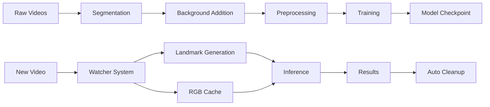

# Vietnam Sign Language Recognition System

Hệ thống nhận dạng ngôn ngữ ký hiệu Việt Nam sử dụng nhiều mô hình deep learning bao gồm S3D, VideoMAE và các kỹ thuật xử lý video tiên tiến.

## 📋 Mục lục

- [Cài đặt môi trường](#cài-đặt-môi-trường)
- [Cấu trúc dự án](#cấu-trúc-dự-án)
- [Chuẩn bị dữ liệu](#chuẩn-bị-dữ-liệu)
- [Training các mô hình](#training-các-mô-hình)
- [Inference](#inference)
- [Hệ thống Watcher](#hệ-thống-watcher)

## 🛠️ Cài đặt môi trường

### Yêu cầu hệ thống
- Python >= 3.9
- PyTorch >= 1.13.1+cu116
- Torchvision >= 1.14.1
- CUDA 11.0+ (cho GPU training)
- RAM >= 16GB
- GPU memory >= 8GB (khuyến nghị)

### Cài đặt dependencies

```bash
# Clone repository
git clone https://github.com/pml0607/Vietnam_Signlanguage_FE.git
cd Vietnam_Signlanguage_FE

# Cài đặt các thư viện cần thiết
pip install -r requirements.txt

# Cài đặt thêm transformers cho VideoMAE
pip install transformers
pip install pytorchvideo
pip install fire
pip install watchdog
```

### Cấu hình CUDA
```bash
# Kiểm tra CUDA
nvidia-smi
python -c "import torch; print(torch.cuda.is_available())"
```

## 📁 Cấu trúc dự án

```
Vietnam_Signlanguage_FE/
├── Configurate/           # File cấu hình training
│   ├── train.yaml         # Cấu hình S3D training
│   ├── landmark_config.yaml
│   ├── segmentation.yaml  # Cấu hình segmentation
│   ├── data_preprocess.yaml
│   └── validate.yaml
├── S3D/                   # Mô hình S3D (3D CNN)
│   ├── train.py           # Training script
│   ├── model.py           # Kiến trúc mô hình
│   ├── dataset.py         # Data loader
│   ├── preprocess_sliding.py  # Tiền xử lý RGB
│   └── validate.py        # Evaluation script
├── Transformer/           # Các mô hình Transformer
│   ├── rgb/               # VideoMAE RGB only
│   ├── rgb_landmark/      # VideoMAE RGB + Landmark
│   ├── rgb_landmark_v2/   # Phiên bản cải tiến (khuyến nghị)
│   └── 6channel/          # 6-channel fusion
├── Source/                # Hệ thống inference realtime
│   ├── data/              # Thư mục dữ liệu
│   │   ├── rgb/           # Video input
│   │   ├── npy/           # Landmark data
│   │   ├── cache/         # RGB tensor cache
│   │   └── history/       # Processed files
│   ├── Watcher_*.py       # Các watcher component
│   └── run_watcher.py     # Script chạy hệ thống
├── Ultralytics/           # YOLO segmentation
│   ├── segmentation.py    # Tách nền
│   └── add_bg.py          # Thêm background
├── Mediapipe/            # MediaPipe landmark extraction
└── requirements.txt      # Python dependencies
```

## 📊 Chuẩn bị dữ liệu

### 1. Cấu trúc dữ liệu ban đầu

Tổ chức dữ liệu thô theo cấu trúc sau:

```
dataset/
├── A1P1/
│   └── rgb/
│       ├── file1.avi
│       ├── file2.avi
│       └── ...
├── A1P2/
│   └── rgb/
│       ├── file1.avi
│       └── ...
└── ...
```

### 2. Segmentation và thêm background (tùy chọn)

Nếu dataset thiếu đa dạng background, thực hiện các bước sau:

#### Cấu hình segmentation
Chỉnh sửa `Configurate/segmentation.yaml`:
```yaml
video_root: "/path/to/raw/dataset"
output_root: "/path/to/segmented"
model_path: "Ultralytics/yolo11l-seg.pt"
```

#### Chạy segmentation
```bash
python Ultralytics/segmentation.py
python Ultralytics/add_bg.py
```

Kết quả:
```
segmented/
├── bitwised/    # Video đã tách nền
└── mask/        # Mask files

video_with_random_background/
├── A1P1/
│   └── rgb/
└── ...          # Video với background ngẫu nhiên
```

### 3. Tiền xử lý cho training

#### Cấu hình data preprocessing
Chỉnh sửa `Configurate/data_preprocess.yaml`:
```yaml
input_root: "/path/to/processed/dataset"
output_root: "/path/to/preprocessed"
clip_length: 16
stride: 8
```

#### Tạo training clips
```bash
# Cho dataset 3 channel (RGB)
python S3D/preprocess_sliding.py

# Cho dataset 6 channel (RGB + Flow)
python S3D/preprocess_sliding_6ch.py
```

### 4. Tạo landmark data (cho Transformer models)

```bash
cd Source/
python Watcher_Landmark.py \
    --input_dir /path/to/videos \
    --output_dir /path/to/landmarks \
    --config_path model/wholebody_w48_384x384_adam_lr1e-3.yaml \
    --checkpoint_path model/wholebody_hrnet_w48_384x384.pth
```

## 🚀 Training các mô hình

### 1. Training S3D Model

#### Cấu hình training
Chỉnh sửa `Configurate/train.yaml`:

```yaml
paths:
  train_dir: "/path/to/preprocessed/train"
  val_dir: "/path/to/preprocessed/val"
  log_dir: "runs/s3d_experiment"
  best_model_path: "/path/to/save/best_model.pt"

training:
  batch_size: 4
  epochs: 50
  learning_rate: 0.0001
  num_classes: 120  # Số lượng classes
  freeze_until_layer: 10

model:
  pretrained: true
  in_channels: 3

dataloader:
  num_workers: 4

augmentation:
  single_stream:
    enable: true
  dual_stream:
    enable: false
```

#### Chạy training
```bash
cd S3D/
python train.py --config ../Configurate/train.yaml
```

#### Distributed training (multi-GPU)
```bash
python -m torch.distributed.launch --nproc_per_node=2 train.py
```

### 2. Training VideoMAE Models

#### RGB only model
```bash
cd Transformer/rgb/
python train.py \
    --dataset_root_path /path/to/dataset \
    --model_ckpt MCG-NJU/videomae-base \
    --num_epochs 30 \
    --batch_size 8
```

#### RGB + Landmark model (Khuyến nghị)
```bash
cd Transformer/rgb_landmark_v2/
python train.py \
    --dataset_root_path /path/to/dataset \
    --model_ckpt MCG-NJU/videomae-base \
    --num_epochs 30 \
    --batch_size 4
```

#### 6-channel model
```bash
cd Transformer/6channel/
python train.py \
    --dataset_root_path /path/to/dataset \
    --model_ckpt MCG-NJU/videomae-base \
    --num_epochs 30 \
    --batch_size 2
```

### 3. Fine-tuning từ pretrained model

```bash
python train.py \
    --dataset_root_path /path/to/new/dataset \
    --model_ckpt /path/to/pretrained/checkpoint \
    --num_epochs 10 \
    --batch_size 4 \
    --learning_rate 1e-5
```

## 🔍 Inference

### 1. Single video inference

```bash
cd Transformer/rgb_landmark_v2/
python test.py \
    --model_path /path/to/checkpoint \
    --video_path /path/to/video.avi \
    --landmark_path /path/to/landmark.npy
```

### 2. Batch inference

```bash
python inference.py \
    --model_path /path/to/checkpoint \
    --data_dir /path/to/test/data \
    --output_dir /path/to/results
```

### 3. S3D inference

```bash
cd S3D/
python validate.py \
    --model_path /path/to/model.pt \
    --test_dir /path/to/test/data \
    --config ../Configurate/validate.yaml
```

## ⚡ Hệ thống Watcher (Real-time Processing)

Hệ thống watcher tự động xử lý video mới và thực hiện inference real-time với khả năng auto-cleanup.

### Cấu trúc hệ thống
- **Watcher_Landmark.py**: Tạo landmark từ video sử dụng HRNet
- **Watcher_Inference.py**: Thực hiện inference với VideoMAE
- **run_watcher.py**: Điều phối toàn bộ hệ thống với polling
- **Auto-cleanup**: Tự động di chuyển file đã xử lý vào history

### 1. Thiết lập thư mục

```bash
mkdir -p Source/data/{rgb,npy,cache,history/{rgb,npy,cache}}
mkdir -p Source/results
```

### 2. Cấu hình model paths

Chỉnh sửa các đường dẫn trong `Source/run_watcher.py`:

```python
# Landmark model
config_path="/path/to/wholebody_w48_384x288.yaml"
checkpoint_path="/path/to/hrnet_w48_coco_wholebody_384x288-6e061c6a_20200922.pth"

# Inference model  
model_ckpt_path="/path/to/videomae-base-finetuned_47classes/checkpoint-330"
dataset_root_path="/path/to/dataset/for/label/mapping"
```

### 3. Chạy hệ thống watcher

#### Chế độ tổng hợp (Combined mode) - Khuyến nghị
```bash
cd Source/
python run_watcher.py
```

#### Chế độ đơn lẻ
```bash
# Chỉ landmark generation
WATCHER_TYPE=landmark python run_watcher.py

# Chỉ inference
WATCHER_TYPE=inference python run_watcher.py
```

#### SLURM environment
```bash
# Submit job
sbatch --job-name=watcher \
       --gres=gpu:1 \
       --mem=16G \
       --wrap="cd Source && python run_watcher.py"
```

### 4. Sử dụng hệ thống

1. **Upload video**: Đặt file `.avi` vào thư mục `Source/data/rgb/`
2. **Tự động xử lý**: 
   - Hệ thống tự động detect video mới
   - Tạo landmark (.npy) trong `data/npy/`
   - Tạo RGB cache trong `data/cache/`
   - Thực hiện inference
   - Lưu kết quả JSON vào `results/`
3. **Auto-cleanup**: File đã xử lý tự động di chuyển vào `history/`
   - `history/rgb/` - Video files
   - `history/npy/` - Landmark files  
   - `history/cache/` - Cache files

### 5. Monitoring và logs

```bash
# Theo dõi real-time logs
tail -f watcher.log

# Check thread status
grep "MONITOR" watcher.log

# Check processing results
ls Source/results/*.json
```

### 6. Kết quả inference

Mỗi video được xử lý sẽ tạo file JSON kết quả:
```json
{
  "id": "video_001",
  "status": "completed",
  "prediction": {
    "class_id": 15,
    "class_name": "xin_chao"
  },
  "processing_time": 2.34,
  "timestamp": 1640995200.0,
  "video_tensor_file": "video_001.npy",
  "landmark_file": "video_001.npy",
  "landmark_shape": [16, 543, 3]
}
```

## 📈 Evaluation và Validation

### 1. Đánh giá S3D model

```bash
cd S3D/
python validate.py \
    --model_path /path/to/model.pt \
    --test_dir /path/to/test/data \
    --config ../Configurate/validate.yaml
```


## 📚 Tài liệu tham khảo

- [VideoMAE Paper](https://arxiv.org/abs/2203.12602)
- [S3D Paper](https://arxiv.org/abs/1712.04851)
- [HRNet Paper](https://arxiv.org/abs/1908.07919)
- [MediaPipe Holistic](https://google.github.io/mediapipe/solutions/holistic.html)
- [YOLOv11 Documentation](https://docs.ultralytics.com/)


## 📄 License

Distributed under the MIT License. See `LICENSE` for more information.

## 📧 Liên hệ

- Project Link: [https://github.com/pml0607/Vietnam_Signlanguage_FE](https://github.com/pml0607/Vietnam_Signlanguage_FE)
- Issues: [https://github.com/pml0607/Vietnam_Signlanguage_FE/issues](https://github.com/pml0607/Vietnam_Signlanguage_FE/issues)

---

## 🔄 Workflow tổng quan



**Happy coding! 🚀**